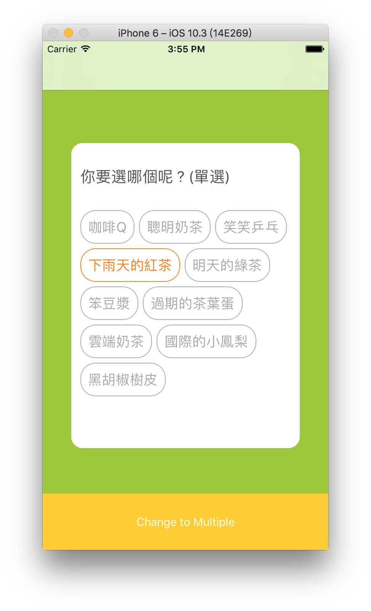
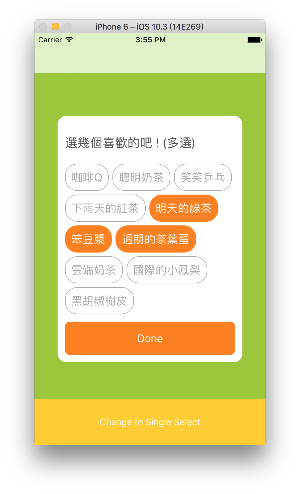

# SMTagView
a simple TagView for Swift, support single select and multiple select.


[](http://mit-license.org)

### Single Select (單選) & Border Type


### Multiple Select (多選) & Fill Type



##Usage
###1.Drag the 'SMTagView.swift' to your project.
###2.Create a UIView on storyboard or xib.
###3.Setting the class of UIView for 'SMTagView'

###4.Setting TagView:

### Single Select 
you will get the callback when user selected.

```swift
self.m_tagViewSingle.layer.cornerRadius = 15.0
self.m_tagViewSingle.tagMainColor = UIColor.orange
self.m_tagViewSingle.setTagForSingle(title: "你要選哪個呢 ? (單選)", tagType: .border, tags: tags)  { (index) in
    print(index)
}
```

### Multiple Select
you can setting maximum select and minimum select,or just put the "nil" if you don't want set any condition,and you will get the callback when user click the "Done" button.

```swift
self.m_tagViewMultiple.layer.cornerRadius = 15.0
self.m_tagViewMultiple.tagMainColor = UIColor.orange
self.m_tagViewMultiple.setTagForMultiple(title: "選幾個喜歡的吧!(多選)", tagType: .fill, tags: tags, maximumSelect: 3, minimumSelect: 2) { (indexes) in
            print("done:\(indexes)")
}
```


## Custom Setting
you can get the other style from these setting.

```swift
var titleColor : UIColor = UIColor.darkGray
var titleFont : UIFont = UIFont.systemFont(ofSize: 20.0)
    
var tagTextColor : UIColor = UIColor.lightGray
var tagCornerRadius : CGFloat = 20.0
var tagMainColor : UIColor = UIColor.orange
    
var doneButtonTitleColor : UIColor = UIColor.white
var doneButtonBackgroundColor : UIColor = UIColor.orange
var doneButtonTitle : String = "Done"
var doneButtonCornerRadius : CGFloat = 8.0
```
